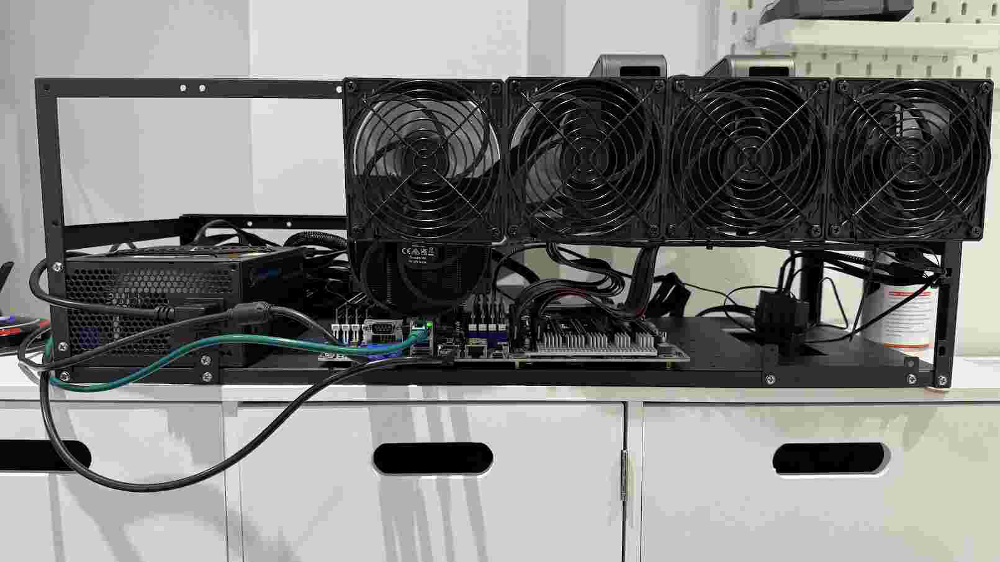

# Homelab hardware

My shopping list

| Component | Model | Notes |
| --- | --- | --- |
| Motherboard | [AsRock Romed8-2T](https://www.asrockrack.com/general/productdetail.asp?Model=ROMED8-2T#Specifications) | Chosen because it has 6 PCIe4.0x16 slots, the 7ths is split between OcuLink/M.2 |
| CPU | [EPYC 7532](https://en.wikipedia.org/wiki/Epyc#Second_generation_Epyc_(Rome)) | 32/64 core/theads, 256MB L3,  200W TDP, 2.4Ghz base clock, 3.3Ghz boost |
| Heatsink | Artic Freezer 4U SP3 | |
| Memory | 8 x Kingston DDR4 ECC Reg | For a total of 256GB of system memory |
| GPU | 2 x Nvidia RTX 3090 Founders Editition | |
| PCIe Riser cables | Coolermaster PCIe4 20cm Riser cables | |
| Case | Ebay GPU Frame | |
| Power Supply | T.F.Skywindl 2000W modular | |

My home lab was encouraged and inspired by [makerun/nerdbox](https://gitlab.com/makerun/nerdbox) . 

It was build primarily to setup and learn about AI.  

