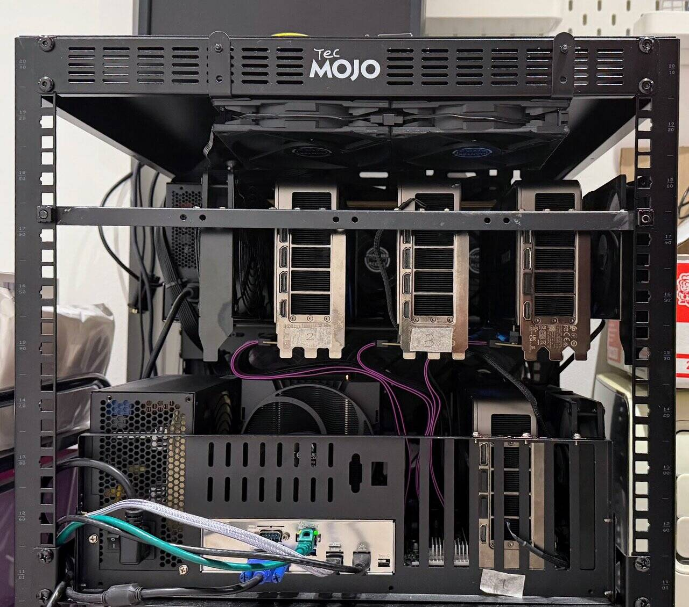

# Homelab hardware

My shopping list

| Component | Model | Notes |
| --- | --- | --- |
| Motherboard | [AsRock Romed8-2T](https://www.asrockrack.com/general/productdetail.asp?Model=ROMED8-2T#Specifications) | Chosen because it has 6 PCIe4.0x16 slots, the 7ths is split between OcuLink/M.2 |
| CPU | [EPYC 7532](https://en.wikipedia.org/wiki/Epyc#Second_generation_Epyc_(Rome)) | 32/64 core/theads, 256MB L3,  200W TDP, 2.4Ghz base clock, 3.3Ghz boost |
| Heatsink | [ARCTIC Freezer 4U-M Rev. 2](https://www.amazon.co.uk/ARCTIC-Freezer-4U-M-Rev-AMD/dp/B09VGTZSDY) | Server CPU cooler with 2x 120mm fans (400-2300 rpm), supports SP3/SP6/TR4/sTRX4. Well reviewed, and in practice running ambient + 30 under load |
| Memory | 8 x Kingston 9965754-053.C00G (32GB DDR4 ECC Reg 3200 MT/s) | For a total of 256GB of system memory |
| GPU | 4 x Nvidia RTX 3090 Founders Edition (part 2204-300-A1, 24GB GDDR6X) | Ebay and CEX |
| PCIe Riser cables | Cooler Master Riser Cable PCIe 4.0 x16 200mm | [PCIe 4.0 x16 to x16 90° riser, 200mm](https://www.amazon.co.uk/dp/B09GBFX5R7). I originally tried cheaper PCIe4.0 riser cables which caused many headaches! |
| Case | Open Air Mining Rig Frame (8 GPU, ATX) | [Thickened open chassis](https://www.amazon.co.uk/dp/B0CQJQV6V9) supporting ITX/Mini-ATX/ATX, holds up to 8 GPUs. GPUs mount on an elevated rail requiring PCIe riser cables to connect to the motherboard. |
| Rack | Tecmojo 20U Open Frame Server & AV Rack | [4-post mobile rack with casters](https://www.amazon.co.uk/dp/B0DBF9TK62), 2x 1U shelves, fits 19" servers and network gear. Replaced the original open-air GPU frame. |
| Power Supply | T.F.Skywindl 2000W modular | Marketed as Mining PSU.  It ony comes with 1 4+4pin CPU cable, so an extra one needed to be ordered as the motherboard has a 4+4 pin CPU and a separate 4 pin CPU power socket, that leaves 6 PCIe 8 (6+2) pin power cables for 3 power hungry GPUs.  Markings suggest it is rated for 1920W on +12V rail. Powers two GPUs and the motherboard. |
| Power Supply 2 | GameMax 850W Rampage | [Full-modular, 80 Plus Bronze, 88% efficiency](https://www.amazon.co.uk/dp/B0CJ9TFFF3). Powers the remaining two GPUs. |
| Extra Fans | 1 Noctua NF-A15 PWM, 14 x Arctic P12 PWM, 2 x 14cm fans | Noctua replaces the loud main PSU fan. The 12cm fans are arranged in 4 intake banks of 3 (one at the rear behind the top 3 GPUs, one at the rear behind the system and bottom GPU, two on the right side) plus 2 exhaust fans on the upper left, creating a back-right to front-left airflow. Two 14cm fans are mounted at the top pushing air down over the top 3 GPUs. |

My home lab was encouraged and inspired by [makerun/nerdbox](https://gitlab.com/makerun/nerdbox) . 

It was build primarily to setup and learn about AI.  

## Thermal Performance

Thermal testing was performed using a 5-minute stress test running [gpu-fryer](https://github.com/huggingface/gpu-fryer) (CUBLAS BF16 matrix multiplication at 95% VRAM across all 4 GPUs simultaneously), with temperatures captured each second using `gputemps`.

Initial testing revealed GPU1 had a critical thermal issue, with junction temperatures peaking at 104°C under load — 16°C above GPU3 (the next worst at 88°C) and well above the target range. GPU0 was the best performer (junction 37–72°C), while GPU2 and GPU3 were acceptable. No GPU throttled despite the elevated temperatures.

GPU1's thermal interface material (TIM) was replaced, bringing its junction peak down from 104°C to 71°C (-33°C) and average die temperature from 67.97°C to 55.63°C. As a side effect, its average compute performance improved by 2.5% (+1,780 GFlops/s). GPU3's TIM was also replaced as a preventive measure. Following both replacements, all four GPUs operate well within safe thermal margins with no throttling under sustained load.

| GPU | GFlops/s (before) | GFlops/s (after) | Avg die temp (before) | Avg die temp (after) | Junction peak (before) | Junction peak (after) |
| --- | --- | --- | --- | --- | --- | --- |
| GPU0 | 73,333 | 73,441 | 55.89°C | 55.70°C | 72°C | 72°C |
| GPU1 | 72,326 | 74,106 (+2.5%) | 67.97°C | 55.63°C (-12°C) | 104°C | 71°C (-33°C) |
| GPU2 | 71,866 | 72,378 | 62.44°C | 58.70°C | 83°C | 80°C |
| GPU3 | 72,386 | 72,508 | 66.53°C | 64.22°C | 88°C | 86°C |

