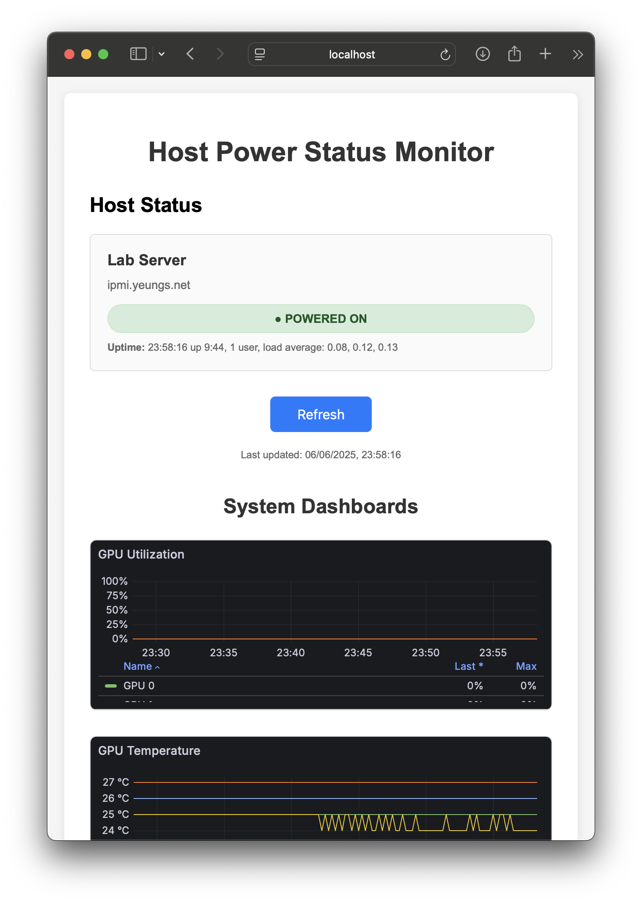

# MyControl - Host Power Status Monitor

A Flask web application for monitoring remote host power status via IPMI.

## Features

- **Host monitoring** - Display power status, uptime, and network connectivity of multiple remote hosts
- **Network connectivity monitoring** - Real-time ping status indicators showing online/offline/error states
- **Power management** - Power on hosts remotely via IPMI when they are powered off
- **Web-based SSH terminals** - Direct SSH access to servers through the browser
- **GPU monitoring** - View nvidia-smi output via expandable sections
- **Real-time nvtop monitoring** - Dedicated terminal windows for live GPU monitoring
- **Compact, clean UI** - Streamlined interface with smaller status indicators and improved layout
- Query IPMI using lanplus protocol
- Asynchronous SSH connections for fast uptime retrieval
- Non-blocking network checks for better performance
- Configuration via JSON file
- Configurable auto-refresh interval and SSH timeout
- Clean web interface with color-coded status indicators
- Automated startup script with virtual environment management
- Comprehensive logging with log rotation
- Background process management

### Application Interface



The application provides a clean, modern web interface featuring:
- **Host Status Cards**: Display server name, power state, network connectivity, and system uptime with load averages
- **Real-time Monitoring**: Auto-refresh functionality and non-blocking network checks keep information current
- **Compact Status Indicators**: Streamlined UI with smaller badges and buttons for better space utilization
- **GPU Monitoring**: nvidia-smi output and dedicated nvtop terminals for real-time GPU monitoring
- **SSH Terminal Access**: Web-based terminals for direct server access
- **Integrated Dashboards**: Embedded Grafana charts for GPU utilization, temperature monitoring, and other system metrics
- **Responsive Design**: Clean 2-column layout that adapts to different screen sizes

## Setup

1. **Create your configuration file**:
```bash
cp config.json.example config.json
# Edit config.json with your actual host details and credentials
```

2. **Start the application** (recommended):
```bash
./control.sh
```

3. **Manual setup** (alternative):
```bash
pip install -r requirements.txt
python app.py
```

## Configuration

The application uses `config.json` for configuration. Start by copying the example:

```bash
cp config.json.example config.json
```

Then edit `config.json` with your actual server details. See `config.json.example` for a complete configuration template with multiple hosts and dashboard examples.

### Configuration Options

- `port`: Web server listening port (default: 5010)
- `refresh_interval`: Auto-refresh interval in seconds (default: 30)
- `ssh_timeout`: SSH connection timeout in seconds (default: 10)
- `ttyd_base_port`: Base port for SSH terminals (default: 7681)
- `ipmitool_path`: Path to ipmitool binary (default: "ipmitool")
- `grafana_dashboard_urls`: Array of Grafana dashboard configurations (optional)
  - `name`: Display name for the dashboard (optional - if omitted, no header is shown)
  - `url`: URL to Grafana dashboard panel
  - `height`: Height of the iframe in pixels (default: 400)
- `hosts`: Array of host configurations
  - `name`: Display name for the host
  - `ipmi_host`: IPMI hostname or IP address (optional)
  - `ipmi_username`: IPMI username (optional)
  - `ipmi_password`: IPMI password (optional)
  - `ssh_host`: SSH hostname or IP address (optional)
  - `ssh_username`: SSH username (optional)
  - `ssh_password`: SSH password (optional)

## Project Structure

```
mycontrol/
├── app.py              # Main Flask application
├── config.json.example # Example configuration file
├── config.json         # Your configuration (create from example)
├── control.sh          # Service control script
├── requirements.txt    # Python dependencies
├── .gitignore          # Git ignore rules
├── templates/          # HTML templates
│   └── index.html
├── static/             # Static assets
│   ├── css/           # CSS stylesheets
│   │   └── style.css
│   └── js/            # JavaScript files
│       └── app.js
├── libs/               # Library modules
│   ├── __init__.py     # Package initialization
│   ├── ssh_utils.py    # SSH functionality
│   ├── grafana_utils.py # Grafana dashboard processing
│   ├── power_management.py # IPMI power control
│   ├── network_utils.py # Network connectivity checks
│   ├── gpu_management.py # GPU monitoring
│   ├── terminal_management.py # SSH/nvtop terminal management
│   └── config_utils.py # Configuration utilities
├── docs/               # Documentation and assets
│   └── images/         # Screenshots and images
├── logs/               # Application logs (auto-created)
└── venv/               # Python virtual environment (auto-created)
```

## Prerequisites

### Required Dependencies

Ensure `ipmitool` is installed on your system:
```bash
# Ubuntu/Debian
sudo apt-get install ipmitool

# CentOS/RHEL
sudo yum install ipmitool

# macOS
brew install ipmitool
```

### Optional Dependencies

For SSH terminal functionality, install `ttyd`:
```bash
# Ubuntu/Debian
sudo apt-get install ttyd

# CentOS/RHEL/Fedora
sudo dnf install ttyd

# macOS
brew install ttyd

# From source (if not available in package manager)
git clone https://github.com/tsl0922/ttyd.git
cd ttyd && mkdir build && cd build
cmake ..
make && sudo make install
```

## Usage

### Control Script Commands

```bash
./control.sh start    # Start the application (default)
./control.sh stop     # Stop the application
./control.sh restart  # Restart the application
./control.sh status   # Show application status
./control.sh logs     # Show and follow application logs
```

### Manual Usage

```bash
python app.py
```

Access the web interface at: http://localhost:5010 (or your configured port)

### SSH Terminal Feature

The application provides web-based SSH terminals through `ttyd`. Each host card includes an "SSH Terminal" button that opens a new browser tab with a terminal session to that server.

**Features:**
- Secure web-based SSH access requiring user authentication
- Automatic terminal cleanup after client disconnects
- Unique port allocation per host to prevent conflicts
- Browser-based terminal with full SSH functionality

**Usage:**
1. Click the "SSH Terminal" button on any host card
2. A new browser tab will open with the terminal session
3. Enter your SSH credentials when prompted
4. Terminal session will automatically close when you disconnect

**Security Notes:**
- Terminals are bound to localhost (127.0.0.1) for security
- Each terminal requires manual SSH authentication
- Sessions automatically terminate after client disconnect
- No SSH credentials are stored or auto-filled

## Logging

Logs are stored in the `logs/` directory:
- `logs/mycontrol.log` - Application logs with rotation (10MB max, 5 backups)
- Console output also available when running manually

## API

- `GET /` - Web interface
- `GET /api/status` - JSON API for host status
- `GET /api/uptime/<hostname>` - Get uptime for a specific host via SSH
- `POST /api/power-on/<hostname>` - Power on a specific host via IPMI
- `POST /api/ssh-terminal/<hostname>` - Start SSH terminal for a host
- `GET /api/ssh-terminals` - List active SSH terminals
- `GET /api/gpu-info/<hostname>` - Get GPU information via nvidia-smi
- `GET /api/ping/<hostname>` - Check network connectivity via ping
- `POST /api/nvtop-terminal/<hostname>` - Start nvtop terminal for a host
- `GET /api/nvtop-terminals` - List active nvtop terminals
- `POST /api/nvtop-stop/<hostname>` - Stop nvtop terminal for a host

## Process Management

The control script:
- Creates/activates Python virtual environment automatically
- Installs/updates requirements
- Runs application in background with PID tracking
- Provides process management commands
- Logs to both file and console

## Security Notes

- **Never commit `config.json`** to version control as it contains sensitive credentials
- Update all default passwords and usernames in your `config.json`
- Use strong, unique passwords for IPMI and SSH access
- Consider using SSH keys instead of passwords for SSH connections
- Restrict network access to the MyControl web interface (port 5010 by default)